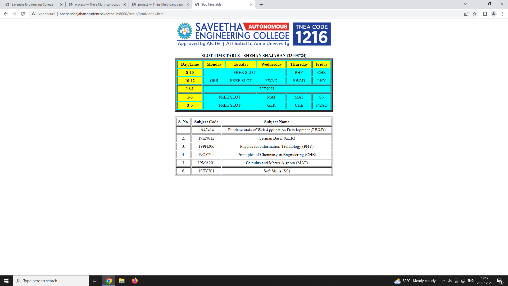

# Experiment_Time_Table

## AIM
To Write a html webpage page to display your timetable.

# ALGORITHM
### STEP 1
create a simple table using table tag
### STEP 2
Add header row using th tag
### STEP 3
Add your timetable
### STEP 4
Execute the program

# CODE
```html
<!DOCTYPE html>
<html>
    <head>
        <title>
            Slot Timetable
        </title>
    </head>
    
    <br>
    <br>
    <body align="center">
        <b>
            SLOT TIME TABLE - SHEHAN SHAJAHAN (23008724)
        </b>
        <br>
        <table border="7" bgcolor="cyan" cellpadding="4" cellspacing="3" width="600" align="center">
            <tr>
                <th align="center" bgcolor="yellow">Day/Time</th>
                <th align="center" bgcolor="yellow">Monday</th>
                <th align="center" bgcolor="yellow">Tuesday</th>
                <th align="center" bgcolor="yellow">Wednesday</th>
                <th align="center" bgcolor="yellow">Thursday</th>
                <th align="center" bgcolor="yellow">Friday</th>
            </tr>
            <tr>
                <th align="center" bgcolor="yellow">8-10</th>
                <td align="center" colspan="3">FREE SLOT</td>
                <td align="center">PHY</td>
                <td align="center">CHE</td>
            </tr>
            <tr>
                <th align="center" bgcolor="yellow">10-12</th>
                <td align="center">GER</td>
                <td align="center">FREE SLOT</td>
                <td align="center">FWAD</td>
                <td align="center">FWAD</td>
                <td align="center">PHY</td>
            </tr>
            <tr>
                <th align="center" bgcolor="yellow">12-1</th>
                <td align="center" colspan="5">LUNCH</td>
            </tr>
            <tr>
                <th align="center" bgcolor="yellow">1-3</th>
                <td align="center" colspan="2">FREE SLOT</td>
                <td align="center">MAT</td>
                <td align="center">MAT</td>
                <td align="center">SS</td>
            </tr>
            <tr>
                <th align="center" bgcolor="yellow">3-5</th>
                <td align="center" colspan="2">FREE SLOT</td>
                <td align="center">GER</td>
                <td align="center">CHE</td>
                <td align="center">FWAD</td>
            </tr>
        </table>
        <br>
        <table border="3" cellpadding="4" cellspacing="3" width="600" align="center">
            <tr>
                <th align="center">S. No.</th>
                <th align="center">Subject Code</th>
                <th align="center">Subject Name</th>
            </tr>
            <tr>
                <td align="center">1.</td>
                <td align="center">19AI414</td>
                <td align="center">Fundamentals of Web Application Development (FWAD)</td>
            </tr>
            <tr>
                <td align="center">2.</td>
                <td align="center">19EN612</td>
                <td align="center">German Basic (GER)</td>
            </tr>
            <tr>
                <td align="center">3.</td>
                <td align="center">19PH206</td>
                <td align="center">Physics for Information Technology (PHY)</td>
            </tr>
            <tr>
                <td align="center">4.</td>
                <td align="center">19CY205</td>
                <td align="center">Principles of Chemistry in Engineering (CHE)</td>
            </tr>
            <tr>
                <td align="center">5.</td>
                <td align="center">19MA201</td>
                <td align="center">Calculus and Matrix Algebra (MAT)</td>
            </tr>
            <tr>
                <td align="center">6.</td>
                <td align="center">19EY701</td>
                <td align="center">Soft Skills (SS)</td>
            </tr>
        </table>
    </body>
</html>
```
# OUTPUT

